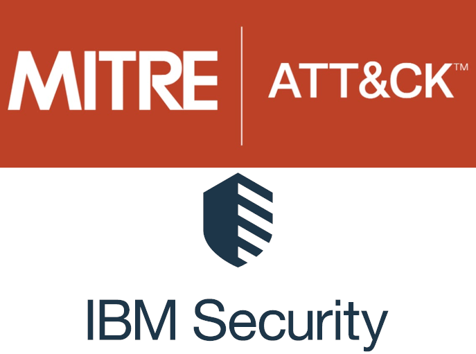
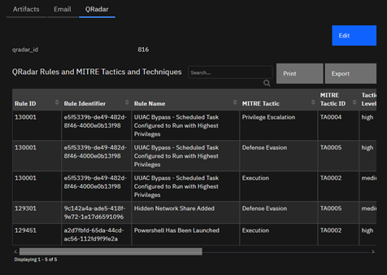
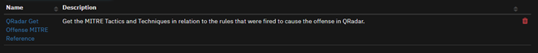
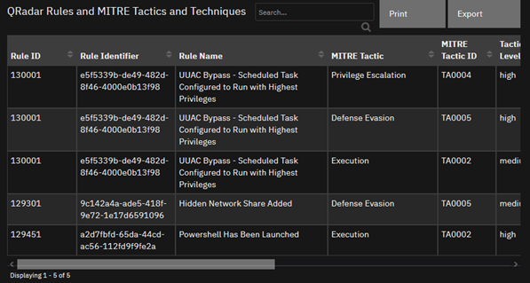

<!--
  This README.md is generated by running:
  "resilient-sdk docgen -p fn_qradar_mitre"

  It is best edited using a Text Editor with a Markdown Previewer. VS Code
  is a good example. Checkout https://guides.github.com/features/mastering-markdown/
  for tips on writing with Markdown

  All fields followed by "::CHANGE_ME::"" should be manually edited

  If you make manual edits and run docgen again, a .bak file will be created

  Store any screenshots in the "doc/screenshots" directory and reference them like:
  

  NOTE: If your app is available in the container-format only, there is no need to mention the integration server in this readme.
-->

# fn_qradar_mitre

## Table of Contents
- [Release Notes](#release-notes)
- [Overview](#overview)
  - [Key Features](#key-features)
- [Requirements](#requirements)
  - [Resilient platform](#resilient-platform)
  - [Cloud Pak for Security](#cloud-pak-for-security)
  - [Proxy Server](#proxy-server)
  - [Python Environment](#python-environment)
  - [Endpoint Developed With](#endpoint-developed-with)
- [Installation](#installation)
  - [Install](#install)
  - [App Configuration](#app-configuration)
  - [Custom Layouts](#custom-layouts)
- [Function - QRadar Get Offense MITRE Reference](#function---qradar-get-offense-mitre-reference)
- [Data Table - QRadar Rules and MITRE Tactics and Techniques](#data-table---qradar-rules-and-mitre-tactics-and-techniques)
- [Custom Fields](#custom-fields)
- [Rules](#rules)
- [Troubleshooting & Support](#troubleshooting--support)
---

## Release Notes
<!--
  Specify all changes in this release. Do not remove the release 
  notes of a previous release
-->
| Version | Date | Notes |
| ------- | ---- | ----- |
| 1.0.0 | 02/2022 | Initial Release | 

---

## Overview
<!--
  Provide a high-level description of the function itself and its remote software or application.
  The text below is parsed from the "description" and "long_description" attributes in the setup.py file
-->
**Resilient Circuits Components for 'fn_qradar_mitre'**

  

fn_qradar_mitre adds support to collect the MITRE reference from the rule that was fired causing the QRadar Offense that is being investigated. This allows us to determine the MITRE Tactic and Technique being used.

### Key Features
<!--
  List the Key Features of the Integration
-->
* Pulls Rules from Qradar and checks if there is a defined Mitre Tactic in relation to the Rule.
* Builds a Data Table displaying those relations, even if there is multiple!

---

## Requirements
<!--
  List any Requirements 
--> 
Qradar must be installed and have an access token available.
This app supports the IBM Resilient SOAR Platform and the IBM Cloud Pak for Security.

### Resilient platform
The Resilient platform supports two app deployment mechanisms, App Host and integration server.

If deploying to a Resilient platform with an App Host, the requirements are:
* Resilient platform >= `40.0.6554`.
* The app is in a container-based format (available from the AppExchange as a `zip` file).

If deploying to a Resilient platform with an integration server, the requirements are:
* Resilient platform >= `40.0.6554`.
* The app is in the older integration format (available from the AppExchange as a `zip` file which contains a `tar.gz` file).
* Integration server is running `resilient-circuits>=41.0.0`.
* If using an API key account, make sure the account provides the following minimum permissions: 
  | Name | Permissions |
  | ---- | ----------- |
  | Org Data | Read |
  | Function | Read |
  

The following Resilient platform guides provide additional information: 
* _App Host Deployment Guide_: provides installation, configuration, and troubleshooting information, including proxy server settings. 
* _Integration Server Guide_: provides installation, configuration, and troubleshooting information, including proxy server settings.
* _System Administrator Guide_: provides the procedure to install, configure and deploy apps. 

The above guides are available on the IBM Knowledge Center at [ibm.biz/soar-docs](https://ibm.biz/soar-docs). On this web page, select your Resilient platform version. On the follow-on page, you can find the _App Host Deployment Guide_ or _Integration Server Guide_ by expanding **Resilient Apps** in the Table of Contents pane. The System Administrator Guide is available by expanding **System Administrator**.

### Cloud Pak for Security
If you are deploying to IBM Cloud Pak for Security, the requirements are:
* IBM Cloud Pak for Security >= 1.4.
* Cloud Pak is configured with an App Host.
* The app is in a container-based format (available from the AppExchange as a `zip` file).

The following Cloud Pak guides provide additional information: 
* _App Host Deployment Guide_: provides installation, configuration, and troubleshooting information, including proxy server settings. From the Table of Contents, select Case Management and Orchestration & Automation > **Orchestration and Automation Apps**.
* _System Administrator Guide_: provides information to install, configure, and deploy apps. From the IBM Cloud Pak for Security Knowledge Center table of contents, select Case Management and Orchestration & Automation > **System administrator**.

These guides are available on the IBM Knowledge Center at [ibm.biz/cp4s-docs](https://ibm.biz/cp4s-docs). From this web page, select your IBM Cloud Pak for Security version. From the version-specific Knowledge Center page, select Case Management and Orchestration & Automation.

### Proxy Server
The app **does** support a proxy server.

### Python Environment
Only Python 3.6 are supported.
Additional package dependencies may exist for each of these packages:
* resilient-circuits>=41.0.0
* resilient-lib>=41.0.0

### Endpoint Developed With

This app has been implemented using:
| Product Name | Product Version | API URL | API Version |
| ------------ | --------------- | ------- | ----------- |
| QRadar | 7.4.3 | https://servername.domain/api | 7.4.3 |

#### Prerequisites
<!--
List any prerequisites that are needed to use with this endpoint solution. Remove any section that is unnecessary.
-->
* QRadar API Token 

#### Configuration
<!--
List any steps that are needed to configure the endpoint to use this app.
-->
* QRadar URL, including https:// or http://
* Add a QRadar API token from the QRadar instance being connected to. 
* If using a self signed cert, verify_ssl should be False. 
* If the use of a proxy is needed, enter in the servername/ip, port, and, if needed, credentials. 

#### Permissions
<!--
List any user permissions that are needed to use this endpoint. For example, list the API key permissions.
-->
* Permissions for QRadar token should be Admin|Admin 


---

## Installation

### Install
* To install or uninstall an App or Integration on the _Resilient platform_, see the documentation at [ibm.biz/soar-docs](https://ibm.biz/soar-docs).
* To install or uninstall an App on _IBM Cloud Pak for Security_, see the documentation at [ibm.biz/cp4s-docs](https://ibm.biz/cp4s-docs) and follow the instructions above to navigate to Orchestration and Automation.

### App Configuration
The following table provides the settings you need to configure the app. These settings are made in the app.config file. See the documentation discussed in the Requirements section for the procedure.

| Config | Required | Example | Description |
| ------ | :------: | ------- | ----------- |
| **api_token** | Yes | `` | *QRadar API Token* |
| **case_manager_uri** | Yes | `/console/plugins/app_proxy:UseCaseManager_Service` | *Case Manager App API URI built into QRadar (likely does not need changed).* |
| **proxy_password** | Yes | `` | *Password of Proxy Server, if needed.* |
| **proxy_port** | Yes | `` | *Port number of Proxy Server, if needed.* |
| **proxy_server** | Yes | `` | *ServerName or IP of Proxy Server, if needed.* |
| **proxy_username** | Yes | `` | *Username of Proxy Server, if needed.* |
| **qradar_api_uri** | Yes | `/api` | *QRadar API URI (likely does not need changed).* |
| **qradar_url** | Yes | `https://server.address` | *QRadar Console ServerName or IP (include https://|http://).* |
| **verify_ssl** | Yes | `[True:False]` | *If using a self-signed cert use False, otherwise you can use True to verify the SSL cert.* |

### Custom Layouts
<!--
  Use this section to provide guidance on where the user should add any custom fields and data tables.
  You may wish to recommend a new incident tab.
  You should save a screenshot "custom_layouts.png" in the doc/screenshots directory and reference it here
-->
* Import the Data Tables and Custom Fields like the screenshot below:

  


---

## Function - QRadar Get Offense MITRE Reference
Get the MITRE Tactics and Techniques in relation to the rules that were fired to cause the offense in QRadar.

 

<details><summary>Inputs:</summary>
<p>

| Name | Type | Required | Example | Tooltip |
| ---- | :--: | :------: | ------- | ------- |
| `qradar_offense_id` | `text` | Yes | `-` | - |

</p>
</details>

<details><summary>Outputs:</summary>
<p>

> **NOTE:** This example might be in JSON format, but `results` is a Python Dictionary on the SOAR platform.


results = {
    'version': 2.0,
    'success': True,
    'reason': None,
    'content': {
        'rules': [{
            'id': 119751,
            'identifier': 'a444890b-eca7-44f7-8903-962c12377715',
            'name': 'Suspicious Activity Followed by Endpoint Administration Task',
            'mapping': {
                'Discovery': {
                    'confidence': 'high',
                    'user_override': False,
                    'enabled': True,
                    'ibm_default': True,
                    'id': 'TA0007',
                    'techniques': {
                        'Network Share Discovery': {
                            'confidence': 'high',
                            'enabled': True,
                            'id': 'T1135'
                        },
                        'Query Registry': {
                            'confidence': 'high',
                            'enabled': True,
                            'id': 'T1012'
                        },
                        'Password Policy Discovery': {
                            'confidence': 'high',
                            'enabled': True,
                            'id': 'T1201'
                        },
                        'Permission Groups Discovery': {
                            'confidence': 'high',
                            'enabled': True,
                            'id': 'T1069'
                        }
                    }
                },
                'Credential Access': {
                    'confidence': 'high',
                    'user_override': False,
                    'enabled': True,
                    'ibm_default': True,
                    'id': 'TA0006',
                    'techniques': {
                        'OS Credential Dumping': {
                            'confidence': 'high',
                            'enabled': True,
                            'id': 'T1003'
                        },
                        'Credentials in Registry': {
                            'confidence': 'high',
                            'enabled': True,
                            'id': 'T1552.002'
                        },
                        'Credentials In Files': {
                            'confidence': 'high',
                            'enabled': True,
                            'id': 'T1552.001'
                        },
                        'Brute Force': {
                            'confidence': 'medium',
                            'enabled': True,
                            'id': 'T1110'
                        }
                    }
                },
                'Command and Control': {
                    'confidence': 'high',
                    'user_override': False,
                    'enabled': True,
                    'ibm_default': False,
                    'id': 'TA0011',
                    'techniques': {}
                }
            }
        }, {
            'id': 111851,
            'identifier': 'e7f90768-1946-4e55-9922-f94bb3d635b7',
            'name': 'QNI : Observed File Hash Associated with Malware Threat',
            'mapping': {
                'Execution': {
                    'confidence': 'high',
                    'user_override': False,
                    'enabled': True,
                    'ibm_default': True,
                    'id': 'TA0002',
                    'techniques': {}
                }
            }
        }, {
            'id': 130651,
            'identifier': '724f71bf-abde-407f-aca7-4451366a7d63',
            'name': 'Workstation Detected with Python, Powershell or Curl as HTTP User Agent',
            'mapping': {}
        }, {
            'id': 118701,
            'identifier': 'f6d184fd-7111-4ca9-b22c-155886a35e7e',
            'name': 'Detection of Malicious IOC',
            'mapping': {
                'Command and
                Control': {
                    'confidence': 'high',
                    'user_override': False,
                    'enabled': True,
                    'ibm_default': False,
                    'id': 'TA0011',
                    'techniques': {}
                }
            }
        }
    ]
    },
    'raw': None,
    'inputs': {
        'qradar_offense_id': '1234'
    },
    'metrics': {
        'version': '1.0',
        'package': 'fn-qradar-mitre',
        'package_version': '1.0.0',
        'host': '76916bde5ac3',
        'execution_time_ms': 3952,
        'timestamp': '2022-02-03 19:19:00'
    }
}

</p>
</details>

<details><summary>Example Pre-Process Script:</summary>
<p>

```python
inputs.qradar_offense_id = incident.properties.qradar_id
```

</p>
</details>

<details><summary>Example Post-Process Script:</summary>
<p>

```python
""" Example Results
{
    'rules': [{
            'id': 119751,
            'identifier': 'a444890b-eca7-44f7-8903-962c12377715',
            'name': 'Suspicious Activity Followed by Endpoint Administration
            Task',
            'mapping': {
                'Discovery': {
                    'confidence': 'high',
                    'user_override': False,
                    'enabled': True,
                    'ibm_default': True,
                    'id': 'TA0007',
                    'techniques': {
                        'Network Share Discovery': {
                            'confidence': 'high',
                            'enabled': True,
                            'id': 'T1135'
                        },
                        'Query Registry': {
                            'confidence': 'high',
                            'enabled': True,
                            'id': 'T1012'
                        },
                        'Password Policy Discovery': {
                            'confidence': 'high',
                            'enabled': True,
                            'id': 'T1201'
                        },
                        'Permission Groups Discovery': {
                            'confidence': 'high',
                            'enabled': True,
                            'id': 'T1069'
                        }
                    }
                },
                'Credential Access': {
                    'confidence': 'high',
                    'user_override': False,
                    'enabled': True,
                    'ibm_default': True,
                    'id': 'TA0006',
                    'techniques': {
                        'OS Credential Dumping': {
                            'confidence': 'high',
                            'enabled': True,
                            'id': 'T1003'
                        },
                        'Credentials in Registry': {
                            'confidence': 'high',
                            'enabled': True,
                            'id': 'T1552.002'
                        },
                        'Credentials In Files': {
                            'confidence': 'high',
                            'enabled': True,
                            'id': 'T1552.001'
                        },
                        'Brute Force': {
                            'confidence': 'medium',
                            'enabled': True,
                            'id': 'T1110'
                        }
                    }
                },
                'Command and Control': {
                    'confidence': 'high',
                    'user_override': False,
                    'enabled': True,
                    'ibm_default': False,
                    'id': 'TA0011',
                    'techniques': {}
                }
            }
        }, {
            'id': 111851,
            'identifier': 'e7f90768-1946-4e55-9922-f94bb3d635b7',
            'name': 'QNI : Observed File Hash Associated with Malware Threat',
            'mapping': {
                'Execution': {
                    'confidence': 'high',
                    'user_override': False,
                    'enabled': True,
                    'ibm_default': True,
                    'id': 'TA0002',
                    'techniques': {}
                }
            }
        }, {
            'id': 130651,
            'identifier': '724f71bf-abde-407f-aca7-4451366a7d63',
            'name': 'Workstation Detected with Python, Powershell or Curl as HTTP User Agent',
            'mapping': {}
        }, {
            'id': 118701,
            'identifier': 'f6d184fd-7111-4ca9-b22c-155886a35e7e',
            'name': 'Detection of Malicious IOC',
            'mapping': {
                'Command and
                Control': {
                    'confidence': 'high',
                    'user_override': False,
                    'enabled': True,
                    'ibm_default': False,
                    'id': 'TA0011',
                    'techniques': {}
                }
            }
        }
    ]
}

"""

for item in results.content['rules']:
  mapping = item['mapping']
  if mapping:
    for tactic in list(mapping):
      techniques = mapping[tactic]['techniques']
      if techniques:
        for technique in list(techniques):
          new_row = incident.addRow('qradar_rules_and_mitre_tactics_and_techniques')
          new_row.rule_id = item['id']
          new_row.rule_identifier = item['identifier']
          new_row.rule_name = item['name']
          new_row.mitre_tactic = tactic
          new_row.mitre_tactic_id = mapping[tactic]['id']
          new_row.tactic_confidence_level = mapping[tactic]['confidence']
          new_row.mitre_technique = technique
          new_row.mitre_technique_id = techniques[technique]['id']
          new_row.technique_confidence_level = techniques[technique]['confidence']
      else:
        new_row = incident.addRow('qradar_rules_and_mitre_tactics_and_techniques')
        new_row.rule_id = item['id']
        new_row.rule_identifier = item['identifier']
        new_row.rule_name = item['name']
        new_row.mitre_tactic = tactic
        new_row.mitre_tactic_id = mapping[tactic]['id']
        new_row.tactic_confidence_level = mapping[tactic]['confidence']
  else:
    new_row = incident.addRow('qradar_rules_and_mitre_tactics_and_techniques')
    new_row.rule_id = item['id']
    new_row.rule_identifier = item['identifier']
    new_row.rule_name = item['name']

```

</p>
</details>

---


## Data Table - QRadar Rules and MITRE Tactics and Techniques

 

#### API Name:
qradar_rules_and_mitre_tactics_and_techniques

#### Columns:
| Column Name | API Access Name | Type | Tooltip |
| ----------- | --------------- | ---- | ------- |
| MITRE Tactic | `mitre_tactic` | `text` | - |
| MITRE Tactic ID | `mitre_tactic_id` | `text` | - |
| MITRE Technique | `mitre_technique` | `text` | - |
| MITRE Technique ID | `mitre_technique_id` | `text` | - |
| Rule ID | `rule_id` | `text` | - |
| Rule Identifier | `rule_identifier` | `text` | - |
| Rule Name | `rule_name` | `text` | - |
| Tactic Confidence Level | `tactic_confidence_level` | `text` | - |
| Technique Confidence Level | `technique_confidence_level` | `text` | - |

---

## Custom Fields
| Label | API Access Name | Type | Prefix | Placeholder | Tooltip |
| ----- | --------------- | ---- | ------ | ----------- | ------- |
| qradar_id | `qradar_id` | `text` | `properties` | - | - |

---


## Rules
| Rule Name | Object | Workflow Triggered |
| --------- | ------ | ------------------ |
| Example: QRadar Get QRadar Rule MITRE Reference | incident | `example_qradar_get_mitre_reference_from_rules` |

---

## Troubleshooting & Support
Refer to the documentation listed in the Requirements section for troubleshooting information.

### For Support
This is a IBM Community provided App. Please search the Community [ibm.biz/soarcommunity](https://ibm.biz/soarcommunity) for assistance.
