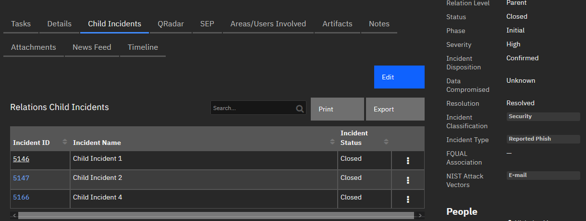
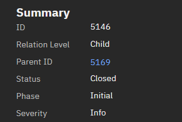

<!--
  This README.md is generated by running:
  "resilient-sdk docgen -p fn_relations"

  It is best edited using a Text Editor with a Markdown Previewer. VS Code
  is a good example. Checkout https://guides.github.com/features/mastering-markdown/
  for tips on writing with Markdown

  If you make manual edits and run docgen again, a .bak file will be created

  Store any screenshots in the "doc/screenshots" directory and reference them like:
  

  NOTE: If your app is available in the container-format only, there is no need to mention the integration server in this readme.
-->

# fn_relations

## Table of Contents
- [Release Notes](#release-notes)
- [Overview](#overview)
  - [Key Features](#key-features)
- [Requirements](#requirements)
  - [SOAR platform](#soar-platform)
  - [Cloud Pak for Security](#cloud-pak-for-security)
  - [Python Environment](#python-environment)
- [Installation](#installation)
  - [Install](#install)
  - [App Configuration](#app-configuration)
  - [Custom Layouts](#custom-layouts)
- [Function - Relations: Assign Parent](#function---relations-assign-parent)
- [Function - Relations: Auto Close Child Incidents](#function---relations-auto-close-child-incidents)
- [Function - Relations: Remove Child Relation](#function---relations-remove-child-relation)
- [Function - Relations: Sync Child Table Data](#function---relations-sync-child-table-data)
- [Function - Relations: Sync Notes](#function---relations-sync-notes)
- [Data Table - Relations Child Incidents](#data-table---relations-child-incidents)
- [Custom Fields](#custom-fields)
- [Custom Artifact Types](#custom-artifact-types)
- [Rules](#rules)
- [Troubleshooting & Support](#troubleshooting--support)
---

## Release Notes
| Version | Date | Notes |
| ------- | ---- | ----- |
| 1.0.0 | 07/2020 | Initial Release |
| 1.0.1 | 05/2021 | Add AppHost Support<br>Patch: Verification of Parent Incident before creating relation |
| 1.0.2 | 04/2023 | Support for Python 3.9<br>Support for CP4S<br>Patch: Verification of Parent and Child Incidents are different <br>Patch: Changed rules to only sync incident notes. |

---

## Overview
The Relations function is meant to provide the ability to allow parent/child relations levels within Resilient to link incidents “manually”. This function allows users sync notes from child to parent and vice versa, close all child incidents under a parent, and update the parent when the status of the child changes.

This document outlines the functionality of function as it relates to Resilient.

**Builds Relationships of Incidents within IBM Security SOAR**

 

This package consists of 5 Functions, 5 Workflows, and 6 Rules along with 2 new fields and 1 new data table.

  1. Assign Parent:
      
      Used to assign children incidents to a parent by supplying the incident ID of the parent. The function configures both parent incident and child incident appropriately.


  2. Remove Child Relation:
      
      Used to remove child relationship with parent by removing all related content created in the relationship.


  3. Sync Notes:
      
      This is used to sync notes between the parent and child incidents with 2 different rules.


  4. Sync Child Table Data:
      
      Used to update child information within the table if the incident name or status changes.


  5. Auto Close Child Incidents:
      
      Allows the closing of all child incidents listed in the parent data table.

### Key Features
* Assign Parent incident to Child 
* Remove Child Relation if established incorrectly
* Sync Notes between Parent and Child
  * Child Notes sync automatically
  * Parent Notes sync manually
* Parent incident contains Data Table of Children incidents
* Sync Child incident data automatically to Parent Data Table
* Auto-close Child incidents on Parent incident closure

---

## Requirements
No application specific configuration settings are required.

This app supports the IBM Security QRadar SOAR Platform and the IBM Security QRadar SOAR for IBM Cloud Pak for Security.

### SOAR platform
The SOAR platform supports two app deployment mechanisms, App Host and integration server.

If deploying to a SOAR platform with an App Host, the requirements are:
* SOAR platform >= `45.0.7899`.
* The app is in a container-based format (available from the AppExchange as a `zip` file).

If deploying to a SOAR platform with an integration server, the requirements are:
* SOAR platform >= `45.0.7899`.
* The app is in the older integration format (available from the AppExchange as a `zip` file which contains a `tar.gz` file).
* Integration server is running `resilient-circuits>=45.0.0`.
* If using an API key account, make sure the account provides the following minimum permissions: 
  | Name | Permissions |
  | ---- | ----------- |
  | Org Data | Read |
  | Function | Read |
  | All Incidents | Read |
  | All Incidents Status | Edit |
  | All Incidents Fields | Edit |
  | All Incidents Notes | Edit |

The following SOAR platform guides provide additional information: 
* _App Host Deployment Guide_: provides installation, configuration, and troubleshooting information, including proxy server settings. 
* _Integration Server Guide_: provides installation, configuration, and troubleshooting information, including proxy server settings.
* _System Administrator Guide_: provides the procedure to install, configure and deploy apps. 

The above guides are available on the IBM Documentation website at [ibm.biz/soar-docs](https://ibm.biz/soar-docs). On this web page, select your SOAR platform version. On the follow-on page, you can find the _App Host Deployment Guide_ or _Integration Server Guide_ by expanding **Apps** in the Table of Contents pane. The System Administrator Guide is available by expanding **System Administrator**.

### Cloud Pak for Security
If you are deploying to IBM Cloud Pak for Security, the requirements are:
* IBM Cloud Pak for Security >= 1.4.
* Cloud Pak is configured with an App Host.
* The app is in a container-based format (available from the AppExchange as a `zip` file).

The following Cloud Pak guides provide additional information: 
* _App Host Deployment Guide_: provides installation, configuration, and troubleshooting information, including proxy server settings. From the Table of Contents, select Case Management and Orchestration & Automation > **Orchestration and Automation Apps**.
* _System Administrator Guide_: provides information to install, configure, and deploy apps. From the IBM Cloud Pak for Security IBM Documentation table of contents, select Case Management and Orchestration & Automation > **System administrator**.

These guides are available on the IBM Documentation website at [ibm.biz/cp4s-docs](https://ibm.biz/cp4s-docs). From this web page, select your IBM Cloud Pak for Security version. From the version-specific IBM Documentation page, select Case Management and Orchestration & Automation.

### Python Environment
Both Python 2.7 and Python 3.6 are supported.
Additional package dependencies may exist for each of these packages:
* resilient-circuits>=45.0.0
* resilient-lib>=45.0.0

---

## Installation

### Install
* To install or uninstall an App or Integration on the _SOAR platform_, see the documentation at [ibm.biz/soar-docs](https://ibm.biz/soar-docs).
* To install or uninstall an App on _IBM Cloud Pak for Security_, see the documentation at [ibm.biz/cp4s-docs](https://ibm.biz/cp4s-docs) and follow the instructions above to navigate to Orchestration and Automation.

### App Configuration
No application specific configuration settings are required.

### Custom Layouts

* Import the Data Tables and Custom Fields like the screenshot below:

#### If Relation Level is: **Parent**

New Tab: Child Incidents
  - Add Relations Child Incidents data table

Summary Section:
  - Add Relation Level 

  

#### If Relation Level is: **Child**

Summary Section:
  - Add Relation Level
  - Parent ID

  

---

## Function - Relations: Assign Parent
Create a parent/child relationship between the 2 incidents provided.

  

<details><summary>Inputs:</summary>
<p>

| Name | Type | Required | Example | Tooltip |
| ---- | :--: | :------: | ------- | ------- |
| `relations_child_incident_id` | `number` | Yes | `-` | - |
| `relations_parent_incident_id` | `number` | Yes | `-` | - |

</p>
</details>

<details><summary>Outputs:</summary>
<p>

> **NOTE:** This example might be in JSON format, but `results` is a Python Dictionary on the SOAR platform.

```python
results = {
    'child_artifact_results': {"success": True, "content": {'description': 'Parent Incident ID in Relationship',
                                'type': 'related_parent_incident',
                                'value': 2345}},
    'table_addition_results': {"success": True, "content": {'cells': {'relations_incident_id': {'value': '<div class="rte"><div><a href="#incidents/1234" target="_blank">1234</a></div></div>'},
                                     'relations_incident_name': {'value': "Child Incident Name"},
                                     'relations_incident_status': {'value': 'A'}
                           }}},
    'parent_artifact_results': {"success": True, "content": {'description': 'Parent Incident ID in Relationship',
                                'type': 'related_parent_incident',
                                'value': 2345}},
    'notes_synced': 5
} 
```

</p>
</details>

<details><summary>Example Pre-Process Script:</summary>
<p>

```python
inputs.relations_child_incident_id = incident.id
inputs.relations_parent_incident_id = rule.properties.relations_parent_incident

```

</p>
</details>

<details><summary>Example Post-Process Script:</summary>
<p>

```python
None
```

</p>
</details>

---
## Function - Relations: Auto Close Child Incidents
Close child incidents when the parent incident is closed.

  

<details><summary>Inputs:</summary>
<p>

| Name | Type | Required | Example | Tooltip |
| ---- | :--: | :------: | ------- | ------- |
| `relations_parent_incident_id` | `number` | Yes | `-` | - |

</p>
</details>

<details><summary>Outputs:</summary>
<p>

> **NOTE:** This example might be in JSON format, but `results` is a Python Dictionary on the SOAR platform.

```python
results = {
    "success": True
} 
```

</p>
</details>

<details><summary>Example Pre-Process Script:</summary>
<p>

```python
inputs.relations_parent_incident_id = incident.id

```

</p>
</details>

<details><summary>Example Post-Process Script:</summary>
<p>

```python
None
```

</p>
</details>

---
## Function - Relations: Remove Child Relation
Used to remove the relation child relation from a Child incident as well as removing the parent relation from the Parent incident if it no longer has children.

  

<details><summary>Inputs:</summary>
<p>

| Name | Type | Required | Example | Tooltip |
| ---- | :--: | :------: | ------- | ------- |
| `relations_child_incident_id` | `number` | Yes | `-` | - |
| `relations_remove_notes` | `boolean` | Yes | `-` | - |

</p>
</details>

<details><summary>Outputs:</summary>
<p>

> **NOTE:** This example might be in JSON format, but `results` is a Python Dictionary on the SOAR platform.

```python
results = {
    "success": True
} 
```

</p>
</details>

<details><summary>Example Pre-Process Script:</summary>
<p>

```python
inputs.relations_child_incident_id = incident.id
inputs.relations_remove_notes = rule.properties.relations_remove_notes

```

</p>
</details>

<details><summary>Example Post-Process Script:</summary>
<p>

```python
None
```

</p>
</details>

---
## Function - Relations: Sync Child Table Data
Update data within the Parent Table if the Child data changes.

  

<details><summary>Inputs:</summary>
<p>

| Name | Type | Required | Example | Tooltip |
| ---- | :--: | :------: | ------- | ------- |
| `relations_child_incident_id` | `number` | Yes | `-` | - |
| `relations_parent_incident_id` | `number` | Yes | `-` | - |

</p>
</details>

<details><summary>Outputs:</summary>
<p>

> **NOTE:** This example might be in JSON format, but `results` is a Python Dictionary on the SOAR platform.

```python
results = {
    "Success": True,
    "response": {'cells': {'relations_incident_id': {'value': '<div class="rte"><div><a href="#incidents/1234" target="_blank">1234</a></div></div>'},
                                     'relations_incident_name': {'value': "Child Incident Name"},
                                     'relations_incident_status': {'value': 'A'}
} 
```

</p>
</details>

<details><summary>Example Pre-Process Script:</summary>
<p>

```python
import re

regex = re.compile(r'#incidents/(\d+)"')

inputs.relations_parent_incident_id = int(re.findall(regex,incident.properties.relations_parent_id['content'])[0])
inputs.relations_child_incident_id = incident.id

```

</p>
</details>

<details><summary>Example Post-Process Script:</summary>
<p>

```python
None
```

</p>
</details>

---
## Function - Relations: Sync Notes
Sync notes from the incident where the note is currently to the parent or child.

  

<details><summary>Inputs:</summary>
<p>

| Name | Type | Required | Example | Tooltip |
| ---- | :--: | :------: | ------- | ------- |
| `incident_id` | `number` | Yes | `-` | - |
| `relations_note_id` | `number` | Yes | `-` | - |

</p>
</details>

<details><summary>Outputs:</summary>
<p>

> **NOTE:** This example might be in JSON format, but `results` is a Python Dictionary on the SOAR platform.

```python
results = {
    "success": True
} 
```

</p>
</details>

<details><summary>Example Pre-Process Script:</summary>
<p>

```python
inputs.relations_note_id = note.id
inputs.incident_id = incident.id

```

</p>
</details>

<details><summary>Example Post-Process Script:</summary>
<p>

```python
None
```

</p>
</details>

---


## Data Table - Relations Child Incidents

  

#### API Name:
dt_relations_child_incidents

#### Columns:
| Column Name | API Access Name | Type | Tooltip |
| ----------- | --------------- | ---- | ------- |
| Incident ID | `relations_incident_id` | `textarea` | - |
| Incident Name | `relations_incident_name` | `text` | - |
| Incident Status | `relations_incident_status` | `select` | - |

---

## Custom Fields
| Label | API Access Name | Type | Prefix | Placeholder | Tooltip |
| ----- | --------------- | ---- | ------ | ----------- | ------- |
| Relation Level | `relations_level` | `select` | `properties` | - | Is this incident considered a Parent or Child incident? |
| Parent ID | `relations_parent_id` | `textarea` | `properties` | - | Incident Number of the Parent Incident |

---

## Custom Artifact Types
| Display Name | API Access Name | Description |
| ------------ | --------------- | ----------- |
| Related Parent Incident | `related_parent_incident` | Incident ID of the parent of all related incidents to create a relation within Resilient incidents manually. |

---

## Rules
| Rule Name | Object | Workflow Triggered |
| --------- | ------ | ------------------ |
| Example: Relations - Assign Parent Incident | incident | `example_relations_assign_parent` |
| Example: Relations - Close Child Incidents | incident | `example_relations_auto_close_child_incidents` |
| Example: Relations - Remove Child Relation | incident | `example_relations_remove_child_relation` |
| Example: Relations - Sync Notes with Child | note | `example_relations_sync_notes_to_parentchild` |
| Example: Relations - Sync Notes with Parent | note | `example_relations_sync_notes_to_parentchild` |
| Example: Relations - Update Child Incident Parent Data Table | incident | `example_relations_update_child_table_data` |

---


## Troubleshooting & Support
Refer to the documentation listed in the Requirements section for troubleshooting information.

### For Support
This is a IBM Community provided App. Please search the Community [ibm.biz/soarcommunity](https://ibm.biz/soarcommunity) for assistance.
